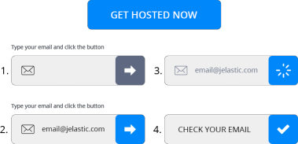

# Application Installation Button

You can offer a solution that will automatically install an application for your customer in just a few clicks (provide an email and confirm via inbox). The ready-to-work button for installation looks as follows:



The widget from this guide is the most straightforward way to add the appropriate button to your website. The only requirement is [jQuery](https://jquery.com/) JavaScript library. The process is simple:

1. You need to upload the ***jlc-app-widget.css*** styles and the ***jlc-app-widget.js*** script that the widget depends on to the root folder of your site. If you don’t need to change the default styles, files can be downloaded directly from the [repository](https://github.com/jelastic/app-widget):
    - https://raw.githubusercontent.com/jelastic/app-widget/master/dist/css/jlc-app-widget.css
    - https://raw.githubusercontent.com/jelastic/app-widget/master/dist/jlc-app-widget.js
    
2. Enable these scripts on any page by adding the following lines between the `<head>` and `</body>` tags:
    ```
    <script async src="{siteUrl}/jlc-app-widget.js"></script>
    <link rel="stylesheet" href="{SiteUrl}/css/jlc-app-widget.css">
    ```
    Don’t forget to substitute the ***{siteUrl}*** placeholder with a correct path to the previously uploaded files.
    
3. Now, insert the following block at the position where the widget should be displayed (add multiple times, if several widgets are required):
    ```html
    <div class="jlc-app" data-key="app.{hoster_domain}" data-app-id="{app-id}"></div>
    ```
    - ***{hoster-domain}*** - [domain name of the platform](https://docs.jelastic.com/jelastic-hoster-info), where an application will be installed. If you skip the data-key parameter, a customer will be able to select any preferred platform.
    - ***{app-id}*** - identifier of a single application from [Marketplace](https://ops-docs.jelastic.com/jca-marketplace/) (for example, app-id=“wordpress”)
    
4. Additionally, you can add the parameter with a specific group where the package should be installed. For example, it can define a group with specialized limits, which will allow users to test some complex application that cannot be installed on the regular trial accounts. Or you can create a dedicated group with bonuses and use for some marketing campaigns.
    ```html
    data-group="{group}"
    ```

5. In case you need to customize the texts of widget elements (e.g. to provide the appropriate translation), please extend it with the following attributes:
    ```html
    data-text="{button-title}" data-tx-success="{success-text}" data-tx-error="{error-text}"
    ```
    
| Parameter        | Description                                       | Default Value  |
| ---------------- |---------------------------------------------------| -----|
| data-text        | The default text (title) displayed on the button. | GET HOSTED NOW |
| data-tx-success  | A text displayed upon operation success.          | CHECK YOUR EMAIL |
| data-tx-error    | A text displayed in case of an error.             | An error has occurred, please try again later. |
    
`
Tip: In case you need multiple widgets with customized localization, you can redefine the default texts in the main variables section of the ../app-widget/assets/js/jlcwidget.js file.
`
